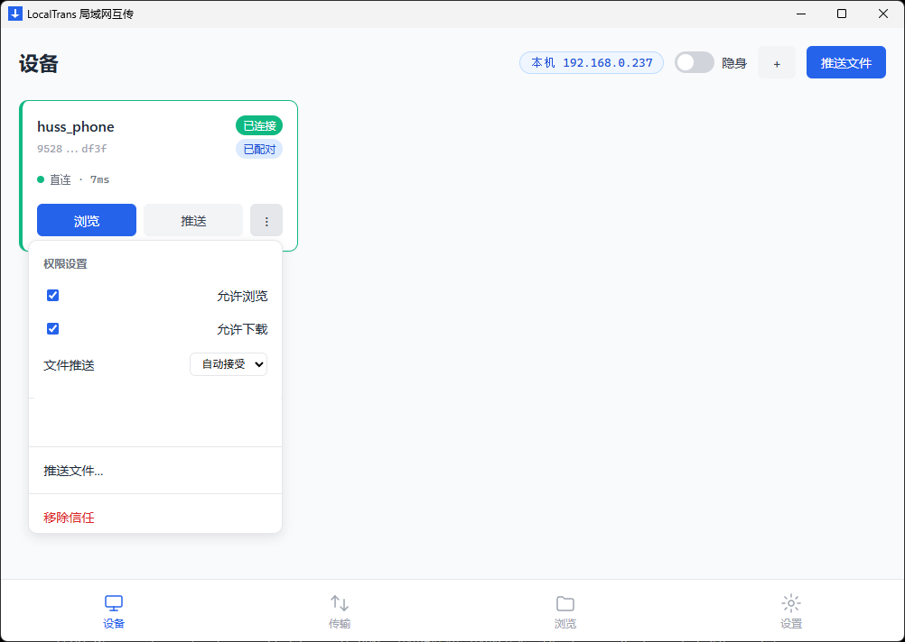
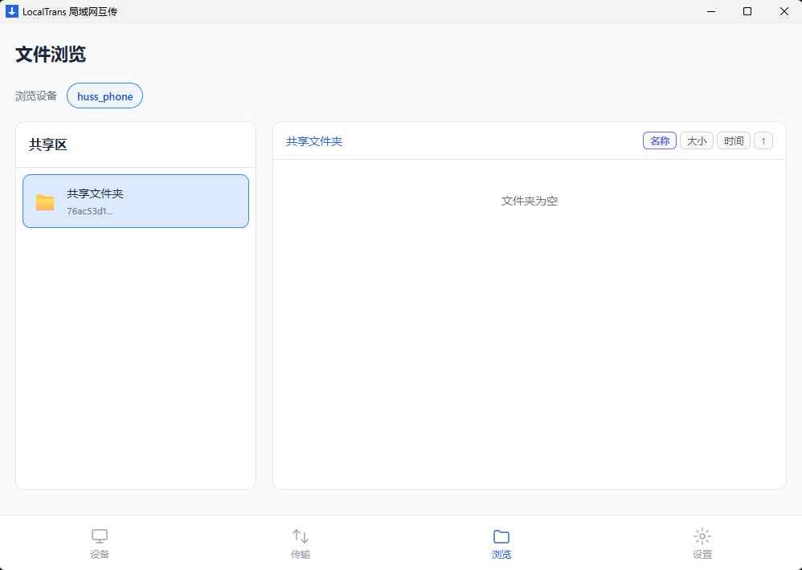
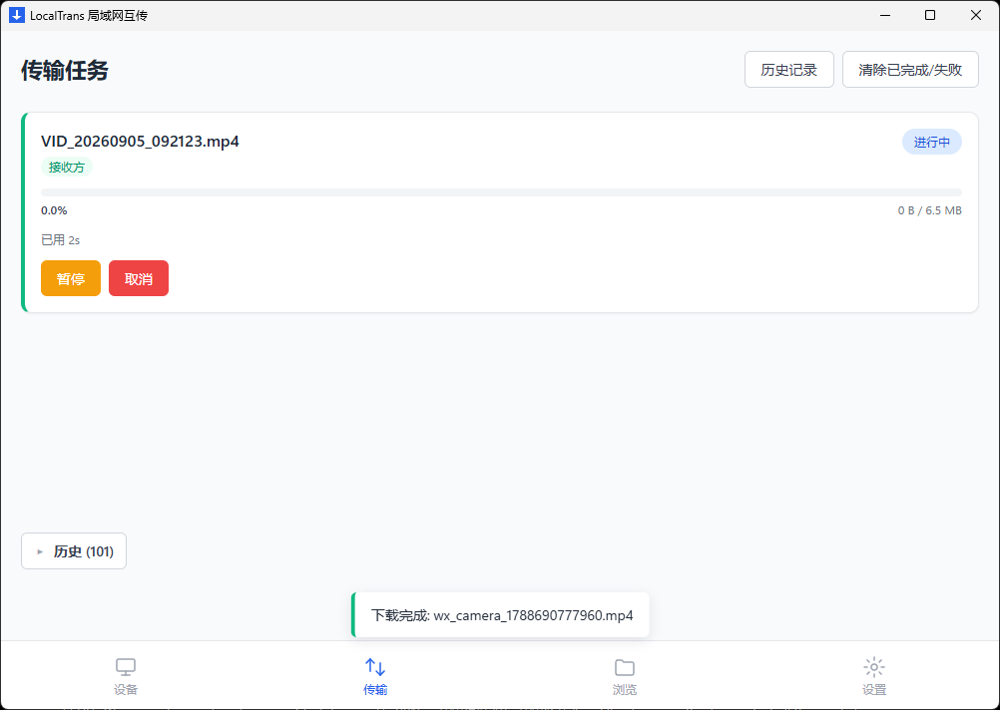
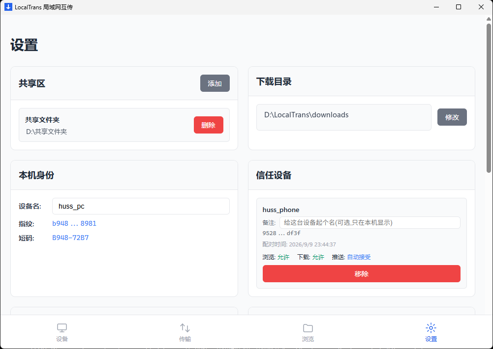
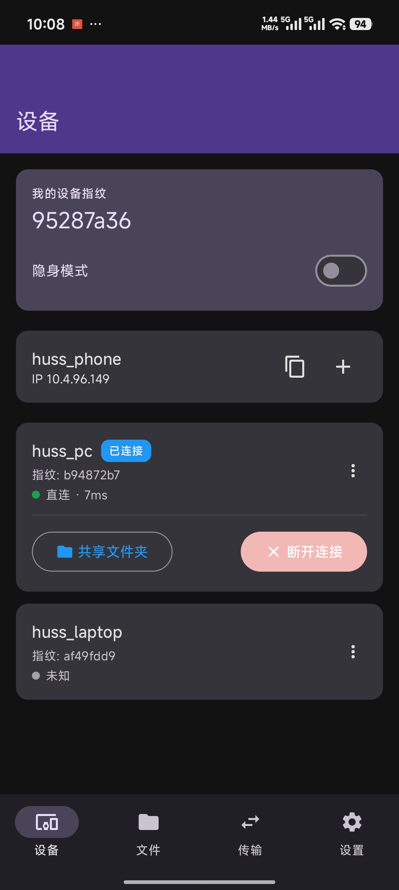
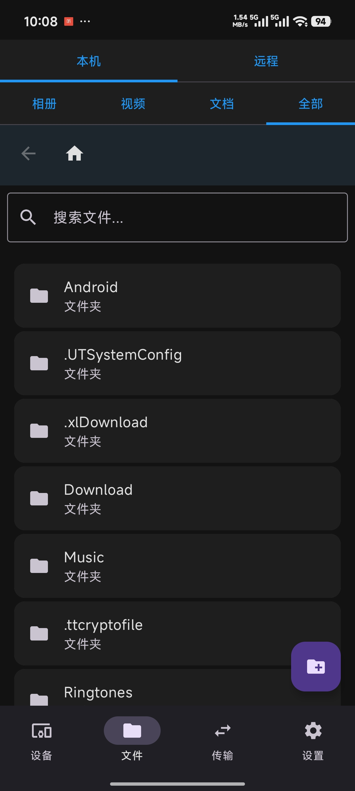
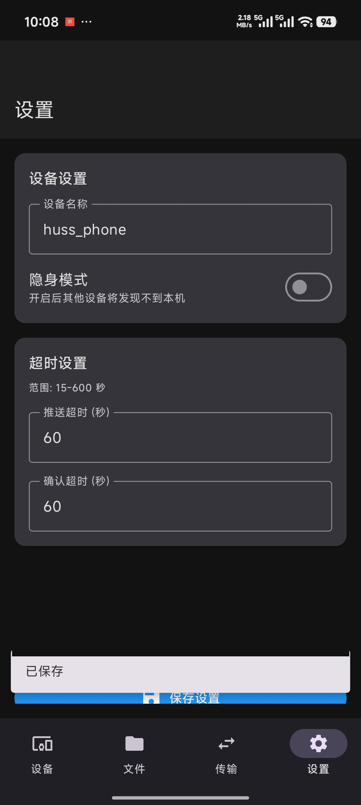
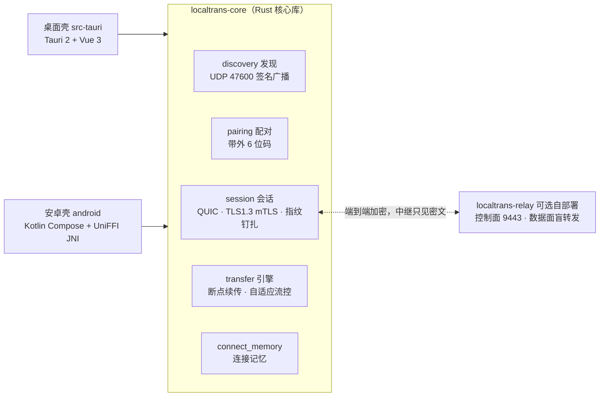

# LocalTrans

基于 Rust + Tauri 2 + Vue 3 的局域网文件传输工具，支持高速传输、断线续传、权限管控。

> **LAN-first encrypted file transfer — no cloud, no account, no telemetry.**
> Rust core over QUIC; the optional relay is a blind forwarder that never sees your files.

<p align="center">
  
  
  
  
</p>
<p align="center">
  
  
  
</p>

## 特性

- **高速传输**：基于 QUIC 协议，千兆网络下可达 iperf3 带宽的 90% 以上
- **断线续传**：支持传输中断后自动恢复，无需重新开始
- **断线自动重连**：连接记忆 + 指数退避静默恢复会话，对端休眠数小时后上线也能接上（见 [docs/connect-memory.md](docs/connect-memory.md)）
- **权限管控**：细粒度的浏览、下载、推送权限控制，接收侧强制执行、未配对默认全拒
- **自适应流控**：根据网络条件动态调整并发流数量，保证最佳传输性能
- **零依赖部署**：单文件便携版，无需安装依赖

## 与常见同类工具的差异

- **传输层是 QUIC 而非 TCP/HTTP**：多流并发 + 自适应流控，验收口径绑定
  iperf3 基准相对值（≥90%），性能论证见下方基准表。
- **配对模型是带外确认而非共享 PIN**：6 位配对码只显示在对端屏幕上、
  从不上网传输；此后每次连接做证书指纹钉扎，中间人没有插入点。
- **接收侧 fail-closed**：浏览/下载/推送逐台授权，未配对全拒；远端文件名
  全部过路径穿越净化——不信任发送方。
- **断了不用管**：分片级断点续传 + 连接记忆静默重连（指数退避、5 败回落、
  对端休眠数小时后上线自动接续），全程至多两条提示。
- **中继是可选自部署的盲转发**：端到端 mTLS 套在转发载荷内层，服务器
  看不见文件名与内容；名册只存内存、重启即清。

## 快速开始

### 1. 下载运行

从 [Releases](../../releases) 下载最新版本的 `localtrans.exe`，双击运行即可。

### 2. 首次运行 - 防火墙设置

首次运行时，需要配置 Windows 防火墙规则以允许局域网发现：

**方法一：使用设置页按钮**
1. 打开应用，进入"设置"页面
2. 点击"防火墙"卡片中的"添加防火墙规则"按钮
3. 确认管理员权限请求

**方法二：手动配置**
以管理员身份运行命令提示符，执行：
```cmd
netsh advfirewall firewall add rule name="LocalTrans" dir=in action=allow protocol=UDP localport=47600-47601
```

### 3. 双机传输流程

#### 3.1 设备发现
两台机器上都启动 LocalTrans，在"设备"页面可以看到局域网内的其他在线设备。

#### 3.2 设备配对
1. 点击设备卡片上的"连接"按钮
2. 对方屏幕弹出同意确认（60s 超时可配），同意后显示 6 位配对码
3. 在本机输入对方屏幕上的码，配对成功后设备加入信任列表
4. 配对码每次随机生成、仅显示在被连接方屏幕上，连接结束即作废

#### 3.3 文件传输
**拉取文件（浏览远程）：**
1. 点击已配对设备的"浏览"按钮
2. 选择远程共享区和文件
3. 点击下载，保存到本机下载目录

**推送文件（主动推送）：**
1. 设备卡片菜单点【推送文件…】选文件；或设备页顶部【推送文件】向导（先选设备再选文件）；或直接拖放文件到设备卡片
2. 对方收到确认弹窗（默认 60s 倒计时，可在设置页调整 15-600s），可选 接收 / 另存到… / 拒绝；超时自动拒绝
3. 被拒绝/超时的任务在传输页可一键【重发】；"自动接受"档接收完成后弹系统通知

#### 3.4 断线续传
- 传输中断后，进入"传输"页面
- 点击可恢复的待处理任务旁的"恢复"按钮
- 系统会自动从中断处继续传输

## 性能基准

### 回环测试（本地进程内，Windows）
| 配置 | 文件大小 | 实测吞吐 | 验收下限（Windows 回环口径） |
|------|----------|----------|----------|
| 本地回环（1GB，SHA-256 全量校验） | 1 GB | ~206 MB/s | ≥150 MB/s |

> **为什么是 150 而不是 300**：QUIC 受限于 MTU 1200B，每个数据报负载小。
> 在 Windows 上用裸 UDP socket 实测 1200B 数据报的回环发送天花板约
> 166 MB/s（作为对照：8KB 数据报约 1051 MB/s，32KB 约 2805 MB/s）。
> 引擎实测 ~206 MB/s 已达裸 socket 速率的 ~124%，剩余差距属操作系统
> 数据报路径而非应用层。真实千兆有线网络上限约 112 MB/s，引擎余量充足。
> 完整论证见 SDD 裁决 R11。

### 千兆网络测试（双机真实环境，待实测）
| 配置 | 文件大小 | LocalTrans | iperf3 基准 | 占比 |
|------|----------|----------|-------------|------|
| 千兆有线 | 1 GB | 待测 | 待测 | 目标 ≥90% |
| 千兆无线 | 1 GB | 待测 | 待测 | - |

**验收标准**：千兆有线环境下，LocalTrans 吞吐量应 ≥ iperf3 基准的 90%。

### 基准测试方法
```bash
# 运行内置回环基准（约 30 秒，含 1GB 测试文件生成与哈希校验）
cargo run --release -p localtrans-core --example bench_loopback

# 使用 iperf3 测试网络基线（双机真实环境）
# 服务器端
iperf3 -s

# 客户端
iperf3 -c <服务器IP> -t 30
```

## 设置说明

### 共享区管理
- **添加共享区**：在设置页面点击"添加"，选择目录并输入别名
- **移除共享区**：点击共享区旁的"删除"按钮

### 下载目录
- 默认为 `data\downloads`（exe 旁的数据目录）
- 可在设置页面修改为其他目录

### 本机身份
- **设备名**：可在设置页面修改，修改后重启生效
- **指纹**：设备的唯一标识，用于配对验证
- **短码**：指纹的短格式，便于人工确认

### 信任设备管理
- **权限设置**：
  - 浏览：允许对方查看本机共享区
  - 下载：允许对方从本机下载文件
  - 推送：控制对方推送文件的行为（每次询问/自动接受/拒绝）
- **移除信任**：点击设备卡片上的"移除"按钮，移除后需重新配对

## 便携版说明

### 数据目录结构
```
localtrans.exe          # 主程序
└── data/              # 数据目录（exe 旁自动创建）
    ├── identity/     # 设备身份文件
    ├── config.json   # 应用配置
    ├── trust.json    # 信任关系
    └── downloads/    # 默认下载目录
```

### 目录迁移注意事项
1. **信任关系失效**：更换 exe 路径后，原有的信任关系会失效，需要重新配对
2. **防火墙规则**：防火墙规则绑定 exe 路径，迁移后需要重新添加规则
3. **配置保留**：将整个 `data\` 目录复制到新位置可保留配置

### 推荐部署方式
将 `localtrans.exe` 放在固定位置（如 `C:\Tools\localtrans.exe`），避免频繁迁移。

## 高级功能（阶段二开发中）
- **中继服务**：支持跨网段传输和 NAT 穿透
- **更多传输协议**：支持除 QUIC 外的其他传输协议
- **批量操作**：支持批量文件选择和传输

## 故障排除

### 1. 设备发现不到
- 检查两台设备是否在同一局域网
- 确认防火墙已正确配置
- 检查路由器是否启用了 AP 隔离

### 2. 传输速度慢
- 确认网络连接质量（使用 iperf3 测试基线）
- 检查是否有杀毒软件干扰
- 尝试调整自适应流控参数

### 3. 配对失败
- 确认双方配对码完全一致
- 检查网络连接稳定性
- 尝试重启应用

## 开发说明

### 构建要求
- Rust 1.70+
- Node.js 18+
- Windows 11

### 开发构建
```bash
# 前端构建
npm run build

# Rust 构建
cargo build -p localtrans

# 运行
npm run dev
```

### 发布构建
```bash
# 便携版发布构建（必须带 tauri/custom-protocol，否则 WebView 加载 devUrl，界面显示"localhost 拒绝连接"）
npm run build
cargo build --release -p localtrans --features tauri/custom-protocol

# 产物位置
target/release/localtrans.exe
```

## 技术架构



- **后端**：Rust + Tauri 2（桌面）/ UniFFI + JNI（安卓）
- **前端**：Vue 3 + TypeScript / Kotlin Compose
- **传输协议**：QUIC (quinn)，UDP 签名广播发现 + 打洞
- **加密**：Ed25519 身份 + TLS 1.3 mTLS 证书指纹钉扎

## 设计与文档

| 文档 | 内容 |
|---|---|
| [DESIGN.md](DESIGN.md) | 设计哲学：隐私默认、fail-closed、性能论证、测试纪律 |
| [docs/connect-memory.md](docs/connect-memory.md) | 连接记忆（mem）机制：数据结构、退避算法、静默重连 |
| [CONTRIBUTING.md](CONTRIBUTING.md) | 从源码构建：环境、开发模式、各平台出包、工程约定 |
| [SECURITY.md](SECURITY.md) | 安全策略：漏洞报告渠道、安全模型、已知取舍 |
| [docs/build-and-test.md](docs/build-and-test.md) | 构建与发版手册（含打包规约与敏感信息门禁） |
| [docs/e2e-harness.md](docs/e2e-harness.md) | 真机 E2E 测试工具链 |
| [AGENTS.md](AGENTS.md) | AI 协作开发公约（泳道 / 门禁 / 禁区） |

## 路线图

- **v0.13.x**：中继服务器地址支持域名；持续打磨批次
- **v1.0.0**（公开承诺的里程碑）：中继配置界面正式开放 · 三端 × 三网交叉验证完成 · 稳定性长测

## 许可证

MIT License

## 贡献

欢迎 Issue 与 PR！从零跑起来只需五分钟，见 [CONTRIBUTING.md](CONTRIBUTING.md)；
安全漏洞请走 [SECURITY.md](SECURITY.md) 的私密报告渠道。